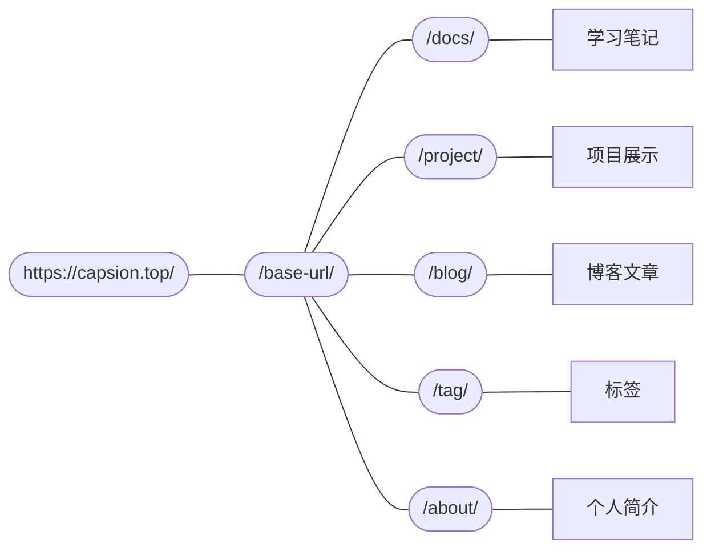

## 项目简介

<div>
        
    
    
    
    
    
    
</div>

程序员这个行业每天都有新的工具诞生，新的轮子出现。好用的工具，好用的轮子都是学不完的，毕竟的记忆范围是有限的，但这些工具，这些轮子又能好好的提高我们的工作效率，所以不停的学习，不停的输入就成了每个程序员掉头发的首要原因。

注明记忆学家`capsion@cps`曾经说过：好记性不如烂笔头！，虽然我们不能记住多则万字千字，少则百字十字的知识点内容，但几个字的知识点名称总能在大脑某处找到个地方存放，所以就有了本博客，起源于有道笔记，结束于csdn。

## 网站展示

<div>


</div>

## 路由结构



## 项目结构

```yaml
DIR:.vitepress          #
   |-- theme/           # 「theme」
   |   |-- components/  # 「components」
   |   |   `-- test.vue #
   |   |-- style/       # 「style」
   |   |   `-- vars.css #
   |   |-- Layout.vue   #
   |   `-- index.ts     #
   |-- utils.ts         #
   |-- Sidebar.ts       #
   |-- Nav.ts           #
   |-- Header.ts        #
   `-- config.ts        #
```

## 网站优化

### 首屏加载慢

首先网站的首屏加载非常慢，通过debug发现，因为首页的轮播组件采用了大量的动态gif作演示，gif图参与了首屏加载，所以会将首屏动画完全卡住，优先要对图片进行优化。

**优化方式：**

- **js**文件请求优化：
  - 能使用cdn的都使用cdn，不再从主站进行请求（react runtime，docuaraus runtime等）

- 图片请求优化：
  - 所有图片使用七牛云cdn
  - 添加一个图片组件，首先先加载预览图，当用户点击才开始加载gif

- 图片压缩优化：
  1. 前端编译完成build时，再次执行一个脚本调用本地的pngquant，对static下的所有png进行压缩
  2. 服务器上的nginx，对所有图片请求进行拦截，判断客户端是否支持webp格式，动态生成webp并返回，同时缓存该图片
  3. 优化轮播组件逻辑，对展示的gif图片进行预览抽取，先加载预览用的小图jpg，然后再异步请求gif，当gif完全下载后再替换小图，同时根据gif时长判断进行自动切换轮播
  4. 整站cdn分发
